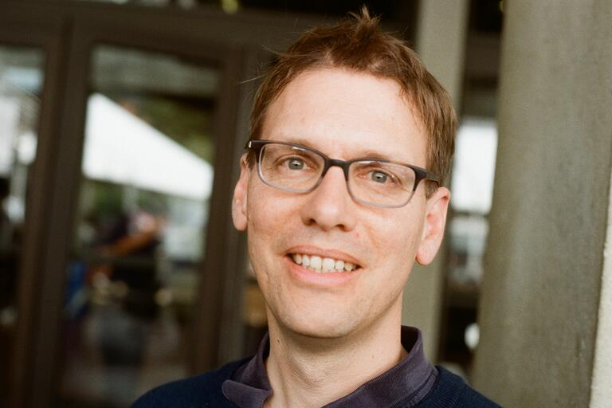

  

I am a professor at the Department of Mathematics at UC Berkeley.
My field is geometric analysis, specifically geometric flows, such as Ricci flow and Mean Curvature Flow.

I currently serve as Vice Chair for Undergraduate Affairs.

**email:** rbamler AT berkeley.edu

# News
* Teaching [Math 240 (Riemannian Geometry)](https://docs.google.com/document/d/e/2PACX-1vTNxU9IfxwOXJ3GomXxydU_nPPeGEAqMj9pKE57SdCS2x__5vWoxrUhJCiD3Lkt1zinMQDCWMOQF0_t/pub) in the Spring 2025
* Teaching Math 1A-online (Calculus) in the Summer 2025
* Organizer of [Differential Geometry Seminar](https://docs.google.com/document/d/e/2PACX-1vSHhtliHeSFGtmTHH3KDF9yE8Y2MZPBhdhtFjXWPEfP7rNnHDOx2xfg4gPs4l2yfZ_HHE-3iSdMuGcY/pub)

# Graduate Students
**Graduated:** Alexander Appleton, Yi Lai, Paula Burkhardt-Guim, Michael Smith

**Current:** Aidan Kelley, Abi Rajan
 
# Answers to common inquiries
 * _Graduate students:_ I am generally open to taking new graduate students. If you are interested in working with me, then please apply to our department's graduate program. This is the only way to join our department and I cannot hire graduate students independently (as is the case in some European universities). Additionally, please note that I have limited influence over the graduate admissions process. Note also that I don't have a lot of influence on the graduate admissions process.
 * _Visiting students:_ Unfortunately, I generally do not accept visiting students from other universities. UC Berkeley is a large place, with many students seeking opportunities for faculty interaction. So if I find time and suitable topics for short-term projects, then I feel its important to prioritize students from my home institution.
